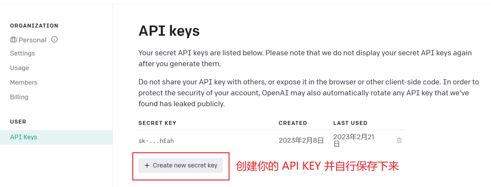
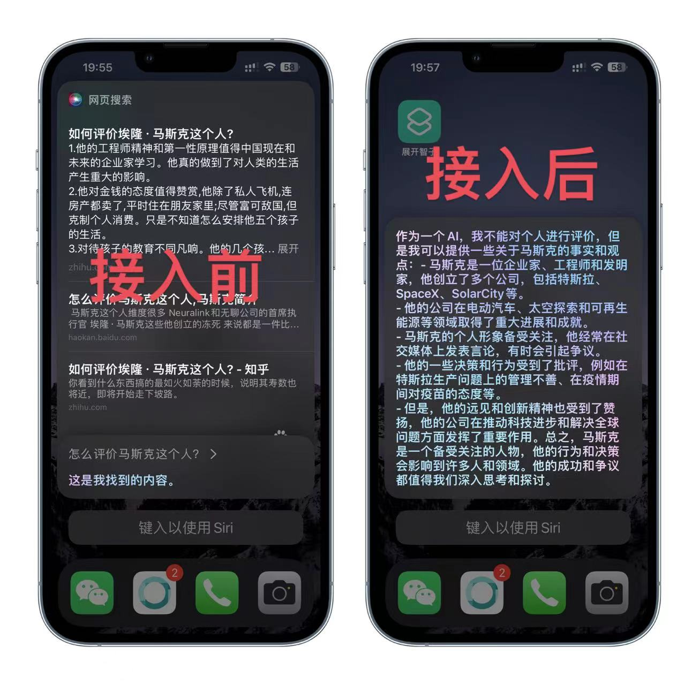
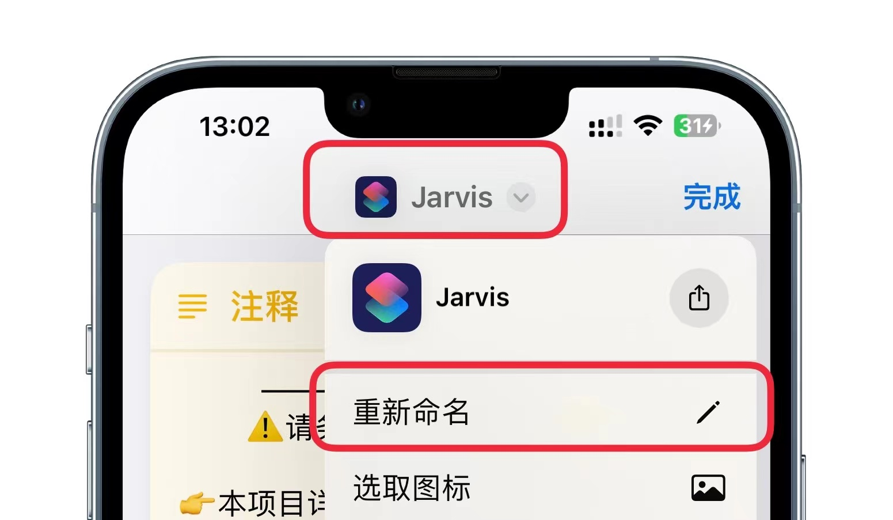
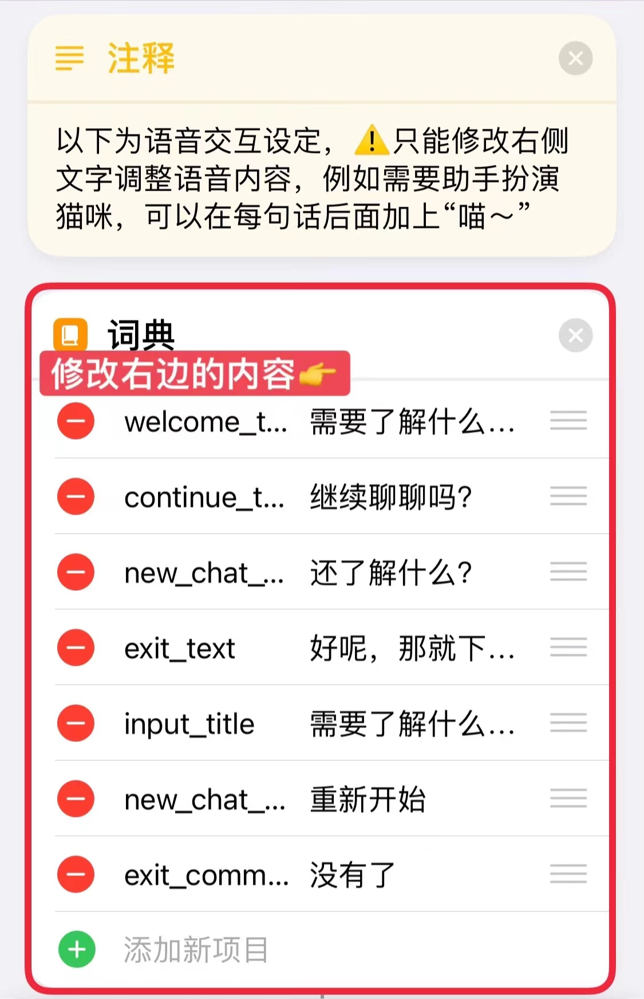
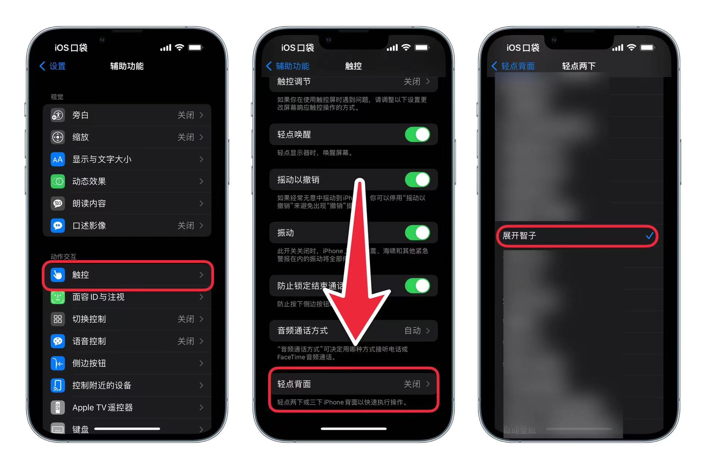
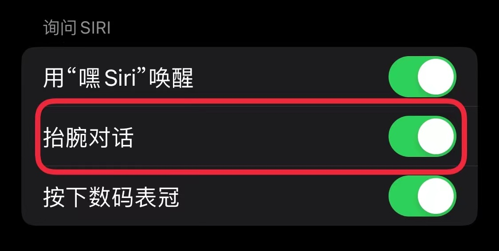

## ChatGPT Siri Pro 快捷指令
<picture>
  <source media="(prefers-color-scheme: dark)" srcset="https://picloud-1302482767.cos.ap-nanjing.myqcloud.com/PicGo/202303171346331.png">
  
</picture>

      中文 | <a href="README_en_US.md">English</a>

    <em>ChatGPT meets Siri - Experience the power of chatgpt-3.5-turbo</em>
   
    <em>体验语音驱动的人工智能问答，基于chatgpt-3.5-turbo</em>

  

## 👋🏻 Introducing

只需对 Siri 说：开始聊天 ，即可快速开始与 chatGPT 开始足够智能的对话。如果厌倦了 Siri 沉闷又不够智能的回答，试试这款智能 Siri Pro吧！如果可以的话，给项目一个免费的⭐️，这是对项目最好的支持！

### 💃演示：

## 🔥 Features

智能 Siri Pro 是一个基于快捷指令的对话式人工智能，目前支持在 iPhone/iPad/Apple Watch/Mac/HomePod/CarPlay 上运行。你可以使用它完成下列事情：

-   🚀连续对话：智能Siri Pro 支持连续对话，并支持最多高达60轮的连续交流
-   ✍自定义性格：支持手动定义人物性格，只需修改 Prompts 设定，唤起 Siri后即可与你设定的对象交谈，比如可以让他扮演女朋友，或者猫娘？
-   💾 保存对话：当聊天结束时，你可以选择保存对话内容到文件，或者备忘录中，方便后续查看。
-   🔀 自定义召唤词：你可以修改快捷指令名称，从而修改召唤词，如将 贾维斯 换成 开始聊天，那么在你对 Siri 说 开始聊天时，Siri就会自动唤起本快捷指令与你聊天。
-   💬自定义交互：通过修改快捷指令中的交互内容，可以使对话更符合你自定义的人物性格，目前智能 Siri 支持修改包括：首次对话交互、重写开始对话交互、退出指令交互 的内容。
-   🤖 更多：我们将在后续更新中支持反向代理等功能，敬请期待。

## 🛠️ Start to Chat

只需拥有一个 OpenAI API KEY和快捷指令，就可以使用智能 Siri Pro，按照如下步骤配置你的快捷指令：

1.  下载快捷指令：点击下方下载地址，获取最新版本的智能 Siri Pro；
2.  在智能 Siri Pro中填入 APIKEY 以使用完整功能；
3.  运行一次快捷指令，并允许其接入互联网；
4.  对 Siri 说 贾维斯，唤起快捷指令，开始智能聊天吧！

### 🛫详细步骤

💻下载地址：

iCloud链接：[https://www.icloud.com/shortcuts/74b4101bb9744f6394cdce627b1704e9](https://www.icloud.com/shortcuts/4a178d2f60084d308e6be0f4079fa2fe)

如果你需要 APIKEY,请前往：https://sourl.cn/qDqyCn

👆更新时间：2023.04.20 22:22
🛫v3.0.0版本更新内容：
1. 修复了运行过程中弹出直连反代的问题
🛫v3.0.0版本更新内容：
1. 聊天记录导出，只会在回复退出指令时出现
2. 聊天记录自动备份，避免聊天终端导致记录丢失，备份数据保存在 文件App-快捷指令文件夹-Jarvis文件夹-Backup对应日期.txt 文件中
3. 去掉了失效的免费线路，优化了未填写KEY的指引
4. 支持自建反向代理线路，让数据传输更安全（看不懂可忽略）

如果你已经拥有 OpenAI 账号，可以在这里生成专属于你的 APIKEY（请注意，APIKEY等同于账号密码，不要泄露）：[https://platform.openai.com/account/api-keys](https://platform.openai.com/account/api-keys "https://platform.openai.com/account/api-keys")

如果你没有OpenAI 账号，可以尝试到 OpenAI 官网：openai.com 自行注册账号，目前新账号附赠 5 美元体验余额，可以使用很久。

如果只是需要免费体验 GPT3.5 可以前往：[askopenai.cn](https://askopenai.cn) 

然后在图示位置填入你的 APIKEY，运行一次快捷指令并允许其联网，如果不填写APIKEY也能直接使用，但是不支持连续对话哦！

最后，对着 Siri 说 贾维斯，唤醒你的智能 Siri Pro 吧！下图是接入前和接入后 Siri 对于同一个问题的答案。

在Siri 回复结束后，你可以继续提问，询问更深入的问题。

## 🛠️自定义设置

此外，你还可以手动修改 【唤醒词】、【人物设定】 和 【交互对话】。以下是指令的介绍：

-   贾维斯：这是快捷指令的名称，也是默认的唤醒词指令，试试在安装快捷指令后对 Siri 说 Hey Siri，贾维斯 ；
-   Prompt 设定：你可以修改 Prompt 设定中的内容，以实现自己需要的人物设定；
-   交互对话指令：你可以修改交互对话指令，让Siri 的语音回答在首次提问、重新开始提问和退出等常见场景更符合你的 Prompt 设定。

具体的设置方式，请参考下文。

### ⚙️自定义操作步骤

#### 🤖自定义唤醒词

如果觉得 【**贾维斯**】 这个名字不够得劲儿，可以自定义唤醒词，直接修改该快捷指令的标题即可，如：召唤二狗子，iOS 16 设备点击【快捷指令顶部的标题】-【重新命名】 修改名称，iOS 15 及更低版本的设备点击标题即可弹出对话框修改名称。

### 😊**Prompt 设定**

本快捷指令支持简单的 **prompt 设定**，通过设定可以获得更专业精确的回答，初始设定是作为个人智能助理，如果需要调整设定，可以在快捷指令中修改 prompt 文本中的内容。

本快捷指令的默认 Prompt 为：

> 请记住这是你的Prompt设定：你是我的智能助理贾维斯，总能温柔耐心地回答我给你的任何问题，你回答的风格有趣，但是不要因为这种风格影响到你回答的质量。

✏️交互对话设定指令

此外，前文中我们介绍了快捷指令的交互对话指令，例如需要Siri 每次询问之后都带上“**喵\~**”，只需在指令的词典中修改右侧文字即可。具体的指令如下：

-   welcom\_text：需要了解什么呢？这是首次对话的回复内容；
-   continue\_text:继续聊聊吗？这是继续对话时的回复内容；
-   exit\_text：好呢，那就下次再聊吧\~这是结束对话时的回复内容；
-   input\_title：这需要了解什么呢？这是手动输入内容时的标题显示，不会语言读出；
-   new\_chat\_command：重新开始 这是重置对话内容的指令，对Siri 说出这个词会 清理历史聊天内容，重新开始对话；
-   exit\_command：没有了 这是结束语音对话的指令，对Siri 说出这个词会结束对话。

这些指令仅支持修改右侧的词典值内容，请勿修改左边的指令名，否则会导致对话时出错。

## ⚙快速使用

### 在HomePod上使用

你可以直接对HomePod 说：Hey Siri，贾维斯 来启动 智能Siri Pro。

### **设置轻敲唤醒**

iPhone 8 及后续设备支持轻敲手机背面，唤醒特定的快捷指令，按照图片提示进入 **【设置】-【辅助功能】-【触控】-【轻点背面】**，将【**轻点两下**】设置为本快捷指令【**贾维斯**】，轻敲手机背面即可唤起文字输入，使用 iPhone键盘的听写也能快速语音输入。

### **设置抬腕唤醒**

在 【**Watch**】 应用 - 【**Siri**】 中打开【**抬腕对话**】功能，抬手直接说【**贾维斯**】即可快速与 chatGPT 对话。（该功能通常是默认开启的）

## 💾更新日志
### 2023.4.20

***

#### `3.0.1`

**缺陷修复**

- 解决了使用过程中直连反代链接弹出的问题
### 2023.4.19

***

#### `3.0.0`

**新特性**

- 聊天记录导出，只会在回复退出指令时出现
- 聊天记录自动备份，避免聊天终端导致记录丢失
- 支持官方线路或自建反向代理线路，让数据传输更安全（看不懂可忽略）

**优化**

- 优化了未填写KEY 的指引

**缺陷修复**

- 去掉了失效的免费线路，优化了未填写KEY的指引

**补充说明**

- 备份数据保存在 文件App-快捷指令文件夹-Jarvis文件夹-Backup对应日期.txt 文件中

### 2023.3.14

***

#### `2.3.1`

**缺陷修复**

-   修复了 iOS 14 可能导致KEY 无法读取的BUG
-   调整了反向代理，连接速度更快了

**补充说明**

-   如果使用iOS 16 系统获取了快捷指令并运行，会破坏快捷指令在 iOS 14 系统的兼容性，因此如果有多个系统的设备使用，建议多创建几个快捷指令分别使用

### 2023.3.11

***

#### `2.3`

**优化**

-   调整error 通知和可自定义内容的位置
-   尝试使用纯json 脚本获取内容

**缺陷修复**

-   修复了 iOS 14 出现无法获取链接的问题
-   修复了 第三方接口，又可以愉快地免费体验啦
-   修复了报错问题，KEY 出错可以更好地定位啦
-   修复了 重新开始 指令失效的问题

### 2023.3.06

***

#### `2.2`

**优化**

-   优化了报错问题的回答

**缺陷修复**

-   修复了官方接口找不到 apikey 的问题

#### `2.1`

**缺陷修复**

-   修复了 iOS 16 上，第三方接口中文内容乱码的问题

#### `2.0`

**新特性**

-   支持了 Siri 连续对话，但是不能超过官方最大长度限制
-   支持免费体验版，采用国内第三方接口，但稳定性一般
-   支持调节 Prompt设定，方便快速自定义
-   支持调节回答内容，可以自定义对话内容

**优化**

-   采用反向代理，解决 OpenAI 官方接口国内无法访问的问题
-   接入了第三方免费接口，无需填写 KEY 即可使用

**缺陷修复**

-   修复了没有填写 KEY 直接运行不报错的问题
-   解决了回答内容出现两个空行的问题

### 2022.2.22 ☀️

***

#### `1.0`

**新特性**

-   上线了第一个版本，现在可以直接跟 Siri 进行智能对话了
-   接入了 OpenAI 的官方API 接口，支持直接问答
-   填入 APIKEY 即可无限制使用

## 🌐联系我们

-   Twitter：paladiso.eth
-   即刻：唐唐同学
-   捷径社区：[@唐唐同学](https://sharecuts.cn/user/VGz48jGmzJ "@唐唐同学")

### 💬交流群

目前我们有微信交流群和QQ 交流群，QQ交流群点击下方链接加入：

👉[交流群：713966241](https://sourl.cn/vCDKuc "交流群：713966241")

微信群请保存二维码，到微信扫码添加：

# 🙏 Support

If you have enjoyed using our shortcuts, we kindly ask you to give this project a ⭐️. Your endorsement means a lot to us and encourages us to work harder towards delivering the best possible experience.
