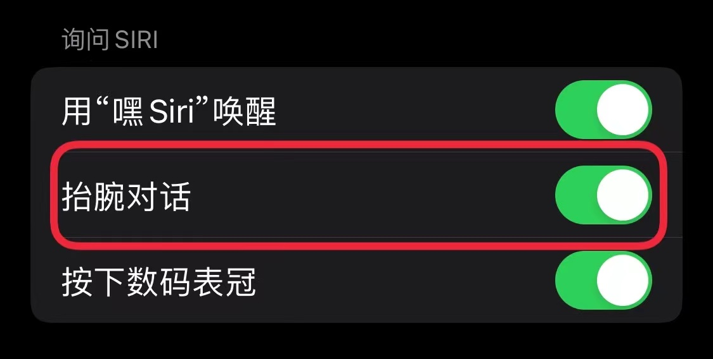

<picture>
  <source media="(prefers-color-scheme: dark)" srcset="https://picloud-1302482767.cos.ap-nanjing.myqcloud.com/PicGo/202303121108782.png">
  
</picture>

      中文 | <a href="README_en_US.md">English</a>

    <em>ChatGPT meets Siri - Experience the power of chatgpt-3.5-turbo</em>
   
    <em>体验语音驱动的人工智能问答，基于chatgpt-3.5-turbo</em>

<!-- iOS Badge -->

  
<!-- iPadOS Badge -->

<!-- watchOS Badge -->

# ChatGPT Siri Pro 快捷指令 介绍

## Table of Contents

- [Download and Obtain Shortcut](#download-and-obtain-shortcut)
- [Instructions](#instructions)
    - [Installation Preparation](#installation-preparation)
        - [Install Shortcut](#install-shortcut)
        - [Fill in your APIKEY](#fill-in-your-apikey)
        - [Free Trial](#free-trial)
    - [Getting Started](#getting-started)
        - [Start Conversation](#start-conversation)
        - [Customize Wake-Up Word](#customize-wake-up-word)
        - [Set Tap Wake-Up](#set-tap-wake-up)
        - [Set Raise-to-Wake Wake-Up](#set-raise-to-wake-wake-up)
- [Advanced Gameplay:](#advanced-gameplay)
    - [Prompt Setting](#prompt-setting)
    - [Interactive Conversation Setting](#interactive-conversation-setting)
    - [Restart and Exit Commands](#restart-and-exit-commands)

🎁This is a shortcut that integrates ChatGPT into Siri, which supports direct connection in China, and can be experienced directly or used with an APIKEY. It has been updated to gpt-3.5-turbo and supports continuous conversation function.

This shortcut mainly supports iPhone and iPad, and also supports use on Apple Watch and macOS (not yet tested). It supports wake-up by raising the hand and tapping the back of the phone.

# Download and Obtain Shortcut

💻The latest version ver 2.3 download links:

1. Real-time update: [https://askgptai.com/siripro](https://askgptai.com/siripro "https://askgptai.com/siripro")
2. iCloud link: [https://www.icloud.com/shortcuts/2e9f11a8a876488fab105ddaff08ba39]("https://www.icloud.com/shortcuts/2e9f11a8a876488fab105ddaff08ba39")

👆Updated on: March 12th, 2023 at 10:42 AM.

# Usage Instructions

😊This shortcut supports plug-and-play, and can be used with the official API interface after filling in the APIKEY. It supports continuous dialogue (still subject to a maximum of 4096 tokens, about 2000 words). If the KEY is not filled in, it will use a third-party API in China.

Here are the specific usage instructions:

## Installation Preparation

### **Install Shortcut**

Click on the download link provided above or [**click here**](https://askgptai.com/siripro "click here") to obtain the shortcut and install it on your iOS device.

### **Enter your APIKEY**

Delete the text box requiring the input of APIKEY in the shortcut, paste your APIKEY to get the complete version that supports continuous dialogue. ⚠Please note that after entering APIKEY, do not directly share the shortcut with your own iCloud link, as this will **leak your APIKEY**!!

If you have an OpenAI account but don't have an APIKEY yet, you can go to the official website to generate your APIKEY at the location shown in the following figure:[https://platform.openai.com/account/api-keys](https://platform.openai.com/account/api-keys "https://platform.openai.com/account/api-keys")

If you don't have an OpenAI account, you can also experience the version without continuous dialogue for free, or go to the website to obtain an OpenAI account and APIKEY:[https://askgptai.com/](https://askgptai.com/ "https://askgptai.com/")

### **Free Trial Available**

You can use the tool for free without an API key, but the continuous conversation feature is not supported. The third-party interface may not be stable, and if no answer is obtained, the following content will be returned:

## Getting Started

### **Starting a Conversation**

To start a conversation with chatGPT, simply say **"Hey Siri, Jarvis"** to your iPhone/iPad/watch/Mac. The image below shows Siri's response to the same question before and after connecting to chatGPT.

If you feel that the initial response is not enough, you can continue to ask Siri, as shown in the following picture, which is the result after follow-up questioning:

### **Customize Wake Word**

If you don't like the name **"Jarvis"**, you can customize your wake word by changing the title of this shortcut. For iOS 16 devices, click the title of the shortcut and select **"Rename"** to change the name. For iOS 15 and earlier versions, simply click the title to bring up the dialog box to rename it.

### **Set Tap to Wake**

Devices iPhone 8 and later support tapping the back of the phone to wake up a specific shortcut. Follow the prompts in **"Settings"** - **"Accessibility"** - **"Touch"** - **"Tap Back"**, and set **"Double Tap"** to this shortcut **"Jarvis"**. You can now tap the back of your phone to bring up the input window and use the iPhone keyboard to quickly input voice commands.

### **Set Wrist Raise Wake**

In the **"Watch"** app - **"Siri"**, turn on the **"Wrist Raise for Siri"** function. Raise your wrist and say **"Jarvis"** to quickly start a conversation with ChatGPT. (This function is usually enabled by default.)

# Advanced Usage

### **Prompt Setting**

This shortcut supports **prompt setting**, which can obtain more professional and accurate answers. The initial setting is as a personal intelligent assistant. If you need to adjust the setting, you can modify the contents in the prompt text in the shortcut.

### **Interactive Dialogue Setting**

This shortcut supports interactive dialogue setting, which can adjust the answer and inquiry to be more coherent when starting and continuing the conversation. For example, if you want Siri to say **"Meow~"** after each inquiry, you only need to modify the text on the right side in the shortcut's dictionary.

### **Restart and Exit Commands**

This shortcut is set to **restart** and **no more** by default. When the corresponding text is included in the conversation, the shortcut will automatically respond. You can also modify the command to achieve custom control. For example, if you change **no more** to **Kneel down**, the shortcut will automatically exit the conversation after hearing **Kneel down**.

